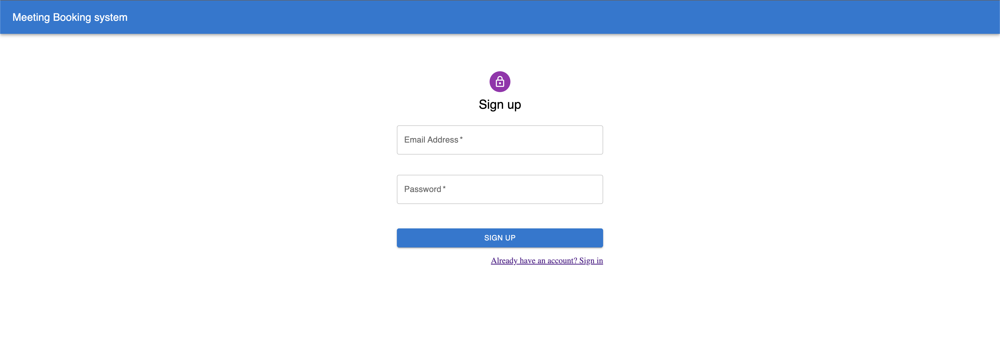
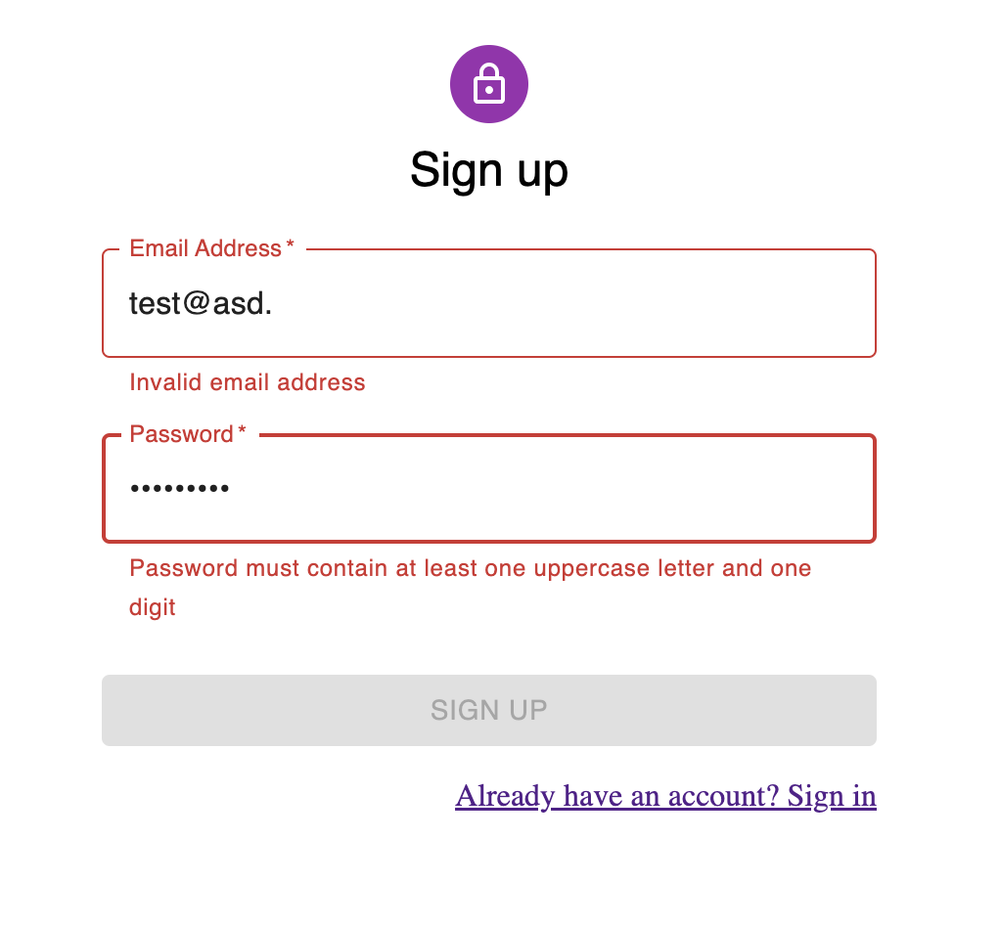
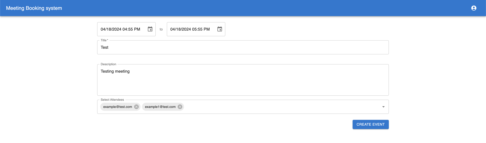
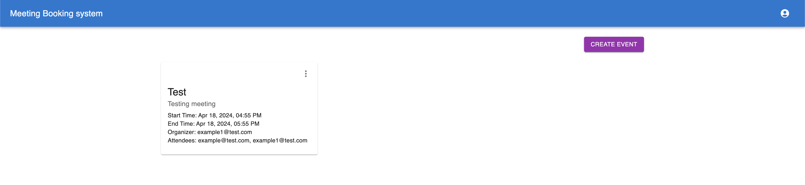

# Meeting Booking System

## Frontend

### Description
This repository houses the frontend component of a meeting booking system designed as a proof-of-concept (PoC). It utilizes ReactJS and Vite to provide a dynamic and responsive user interface for managing meeting schedules effectively.

### Prerequisites
- **Node.js**: Ensure you have Node.js installed. If not, you can download it from [here](https://nodejs.org/en).

## Installation

```bash
$ npm install
```
## Setting Up Environment Variables
- **Copy .env.example**: Duplicate the .env.example file in the root of your project.
- **Rename the File**: Remove the .example extension from the duplicated file so that it becomes .env.
- **Add Your Values**: Open the .env file in a text editor and fill in the required values for your MongoDB connection string and JWT token.
- **Save the File**: Save the .env file with your changes.

## Running the app

```bash
# development
$ npm run dev

```
## Design Choices and Future Considerations

- **Vite**: A modern build tool that offers faster development with hot module replacement and optimized builds, making it a compelling alternative to Create React App for React projects. Vite leverages ES Module imports and supports hot module replacement (HMR), which can significantly speed up the development process by allowing you to see changes in your code almost instantly.
- **Material-UI (MUI)**: A popular React UI framework that implements Google's Material Design. MUI offers a wide range of pre-built components and styles, making it easy to create a consistent and visually appealing user interface. Its theming capabilities allow for easy customization to match your brand's look and feel. MUI also provides responsive design features, accessibility support, and a vibrant community, making it a reliable choice for building modern and user-friendly web applications.
- **Axios**: Axios is a versatile JavaScript library for making HTTP requests in both browsers and Node.js, offering a straightforward API and robust features like interceptors and automatic JSON parsing.

## User Interface

**User login**


**Sign page**



**Email/Password validation**



**Schedule Meeting Form**



**Schedules Meeting View**


